# The Badge

Firmware for a round 466×466 AMOLED badge built on the Waveshare
**ESP32-S3-Touch-AMOLED-1.75C** — the one in the milled aluminium case.
Developed and tested on the **With Battery** version of it.

<p align="center">
  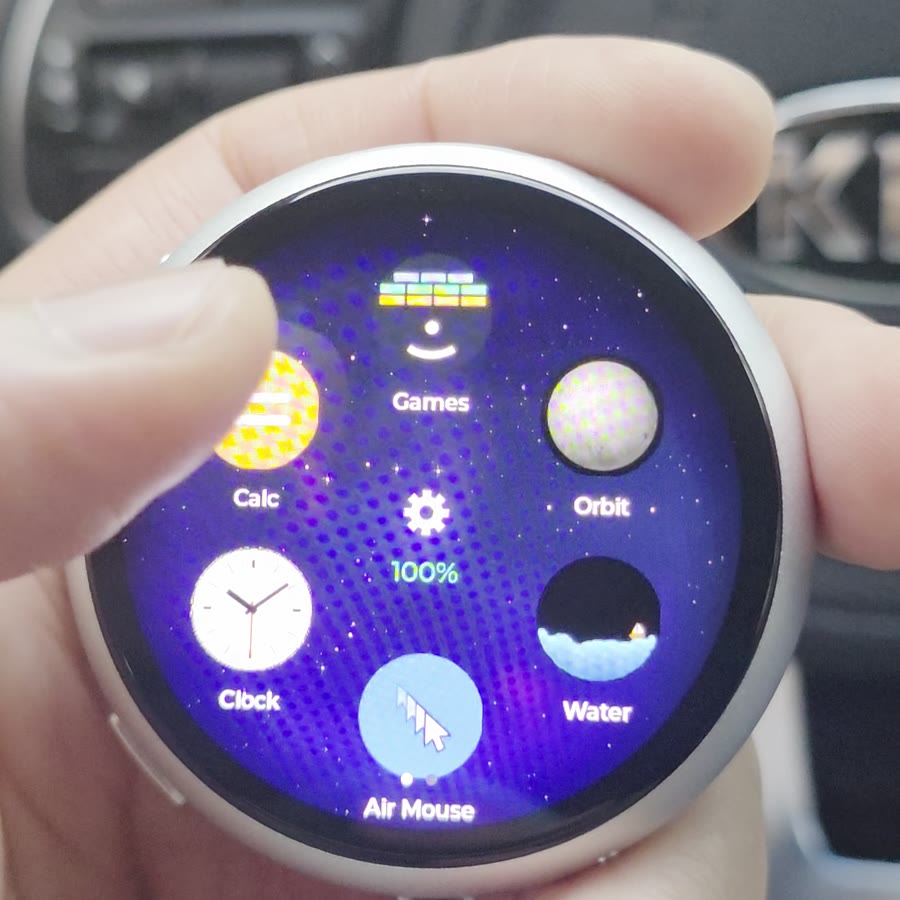
  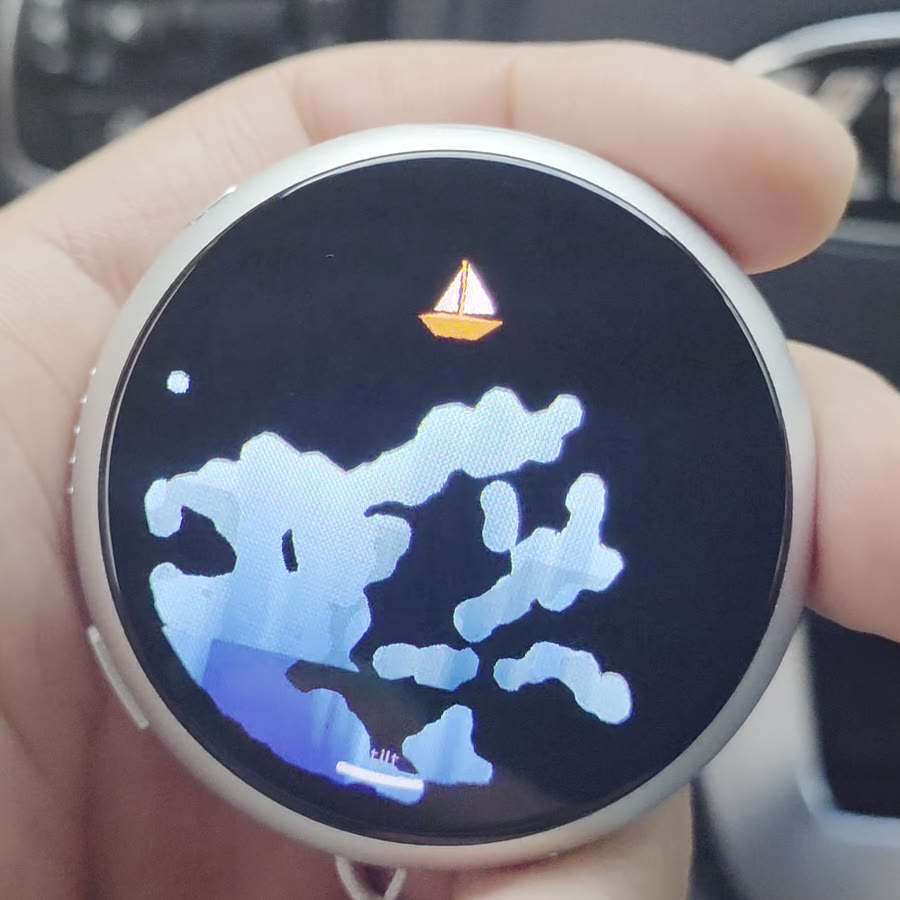
</p>

The trailing **C** is not a revision. Waveshare also sells a plain 1.75, and
it is a different board:

| | 1.75C — this one | 1.75 |
|---|---|---|
| Case | CNC aluminium, badge-shaped | bare board |
| Flash | **32 MB** | 16 MB |
| PSRAM | 8 MB octal | 8 MB octal |
| microSD | none | TF slot |
| RTC | **none** | PCF85063 |

Two of those matter. The partition table assumes 32 MB and most of it is the
recording area, so a 16 MB board will not take this build at all. And the
missing RTC is why the badge goes to the network for the time — cut the power
on a 1.75C and it wakes up in 1970.

It is a thing you wear. It runs about a day on a charge, wakes to a clock, and
does a handful of things well rather than many things badly.

It started as an air mouse — driving a PC from a phone over RDP means toggling
between touch and pointer mode forever, and I wanted something that just
pointed. The rest is what I would actually reach for, minus the voice
assistant and LLM chat the demos for this board are built around; the water,
the orbs and the games are in because I like them. Power was the other reason:
none of Waveshare's own ESP-IDF examples enable `CONFIG_PM_ENABLE` or tickless
idle, and the example that shuts down the twelve unused AXP2101 rails is not
the path the BSP takes. Switching the panel off for real, light sleep and those
rails together took standby here from 11.9 hours to 19.6 — this firmware before
and after that work, not a comparison against the one the board shipped with.

<p align="center">
  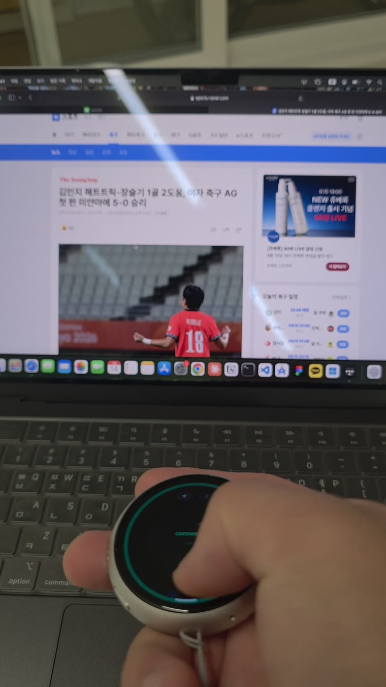
  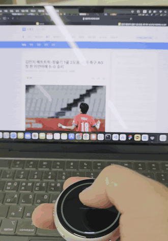
  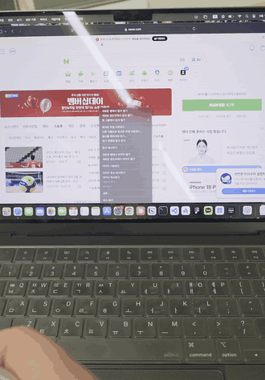
</p>
<p align="center"><sub>Driving a laptop from the glass: the cursor on the left,
a right-click menu on the right. Same BLE HID link either way — hold it and
point, or rub the face like a touchpad.</sub></p>

It is easier to show than to describe. Both of these are the real board,
filmed in one take:

<p align="center">
  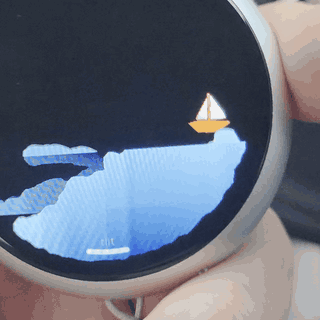
  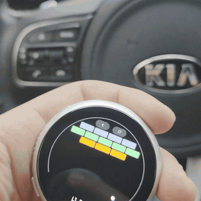
</p>
<p align="center"><sub>Left: the water moves with the board, and the boat rides it.
Right: bricks, with the paddle on the ring.</sub></p>

The rest of these are from the desktop simulator — same code, same pixels:

<p align="center">
  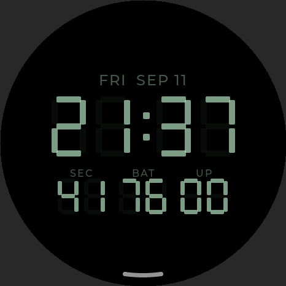
  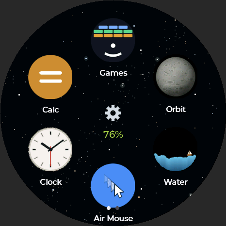
  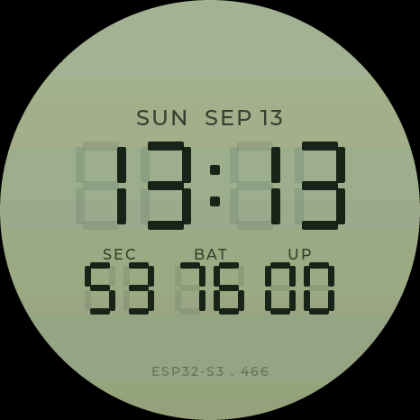
  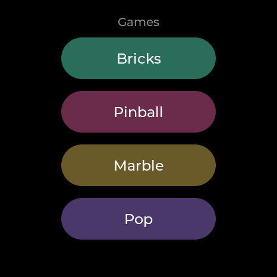
</p>

| | |
|---|---|
| **Trackpad / Air Mouse** | Bluetooth HID. Use it as a touchpad, or point with it — the gyro drives the cursor |
| **Excel keys** | Twelve keys a phone's soft keyboard does not have, in a ring, over the same HID link: F1 F2 F4 F5 F12, Esc Tab Ent Del, Ctrl+; (today), Ctrl+[ (trace precedents), Ctrl+F4. Without F4 there is no touching a formula over RDP from a phone |
| **Clock** | One app, four screens, swiped vertically — a seven-segment face, a timer whose ring closes as it runs, a stopwatch with laps, and an alarm the launcher watches so it rings with the app closed |
| **Recorder** | 16 kHz IMA-ADPCM to flash, about 52 minutes. Plug in and it appears as a read-only USB drive full of `.WAV` files |
| **Games** | Bricks (a ring paddle, five levels, three balls), pinball on a round table, a tilt marble maze, and bubble wrap |
| **Fidgets** | A pool of water and a small solar system, both driven by the accelerometer. The planets are NASA maps, and each one falls back to being drawn in code if you delete it |
| **Calc** | A 4×4 grid loses its corners on a round screen, so the digits run in three columns down the middle and the operators take the flanks |
| **Settings** | Brightness, sound, screen-off delay, time zone, Wi-Fi and Bluetooth pairing — every row carrying its own value so nothing is opened just to be read |

More of them, with screenshots: **<https://curisama.github.io/The-Badge/>**

There is no cloud anything. WiFi comes up for one reason — setting the clock,
and only once the clock has gone stale — plus the scan when you first pick a
network, which you do on the badge itself.

## Flash it without building

If you only want the firmware on a board, there is a browser flasher — no
toolchain, nothing to install:

**<https://curisama.github.io/The-Badge/flash/>**

It needs Chrome or Edge (WebSerial is not in Safari or Firefox). For those,
grab the binaries from a release and use `esptool`; the page lists the
offsets.

## Build

You need [ESP-IDF 5.5](https://docs.espressif.com/projects/esp-idf/en/stable/esp32s3/get-started/)
and nothing else; every other dependency is fetched for you on first build.

```sh
git clone https://github.com/curisama/The-Badge
cd The-Badge
cp main/secrets.example.h main/secrets.h   # optional, may stay empty
idf.py build
idf.py -p /dev/ttyACM0 flash               # COMx on Windows
```

`tools/setup.sh` does the same thing and works out which OS you are on.
The first build downloads roughly 20 MB of components and takes a while; after
that it is quick.

> **Check the board again here.** The partition table assumes the 1.75C's
> 32 MB. On a plain 1.75 the recording partition does not fit and the build
> will not flash.

## Simulator

The whole UI builds and runs on a PC — no board needed. This is how most of it
was written and how it is tested.

```sh
python3 sim/build.py
./sim/badge_sim                 # writes screenshots to shots/
PORT=8792 python3 sim/server.py # then open http://localhost:8792
```

The simulator has a fake IMU and a fake battery, so tilt games and the
power-related screens work there too.

## Recordings

Recordings never leave the badge on their own. Open the recorder, press
**export**, and the badge re-enumerates as a read-only USB drive; the files
show up as `REC0001.WAV` and play in anything. Press **done** and it goes back
to being a serial port.

> Recording other people is regulated differently depending on where you are.
> In some places consent from one party to the conversation is enough; in
> others every participant has to agree. Find out which one applies to you
> before you use this.

## Layout

```
main/              firmware
  apps/            one file per app
  lcdface.c        the clock face, drawn as shapes
  port.h           everything hardware-specific sits behind this
  port_esp.c         the board's half
sim/               the same UI on a PC
  port_sim.c         the simulator's half of port.h
tools/             asset baking, regression checks, setup
docs/SETUP.md      toolchain setup per OS
```

`port.h` is the seam. If a file outside `port_esp.c` talks to hardware
directly, that is a bug.

## Checks

```sh
tools/regress.sh
```

It reads the sources, then drives the simulator for the few faults no pattern
can catch. Half a minute, and it catches the things that have actually broken
here before — not a test suite so much as a list of scars.

## License

MIT, see `LICENSE`. Third-party components are listed in `NOTICE`; none of them
are redistributed in this repository.
